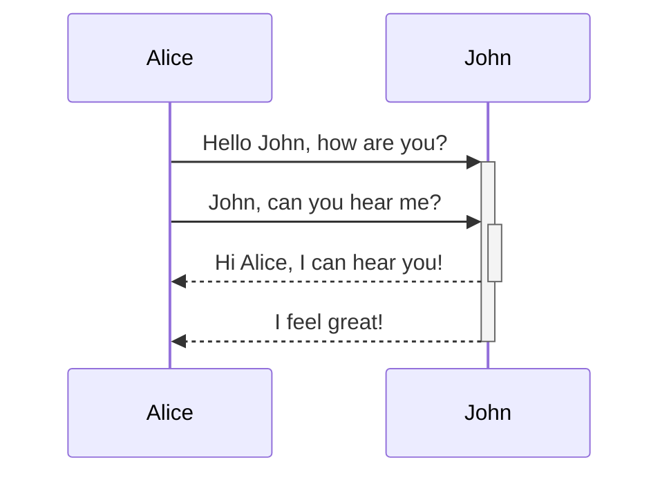
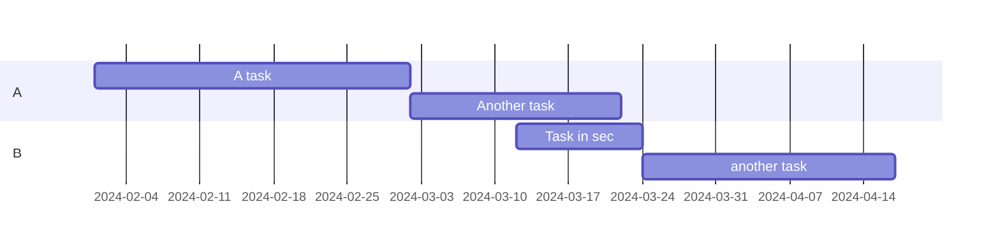
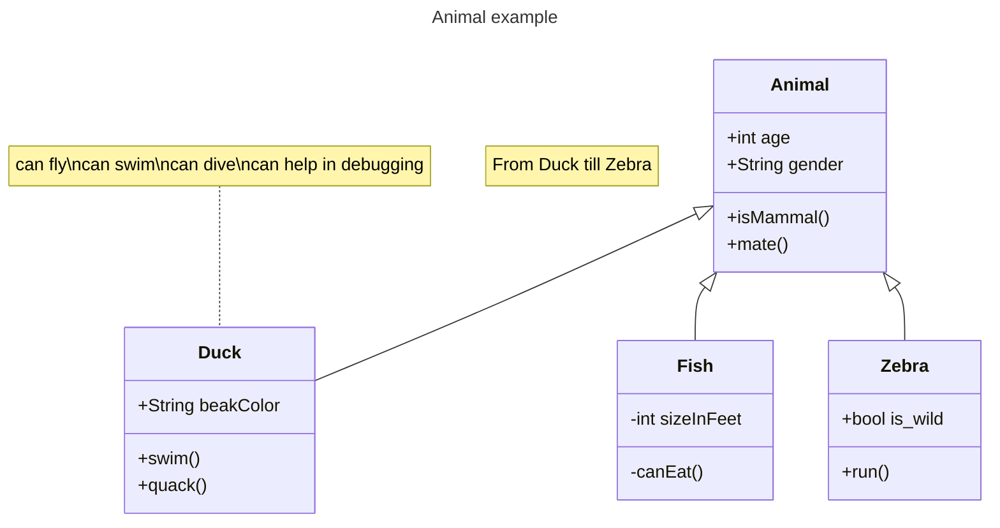
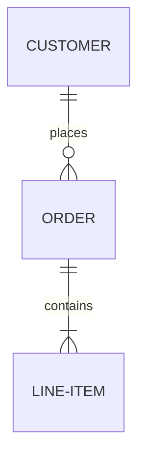
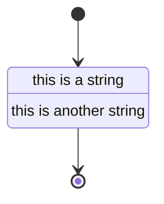
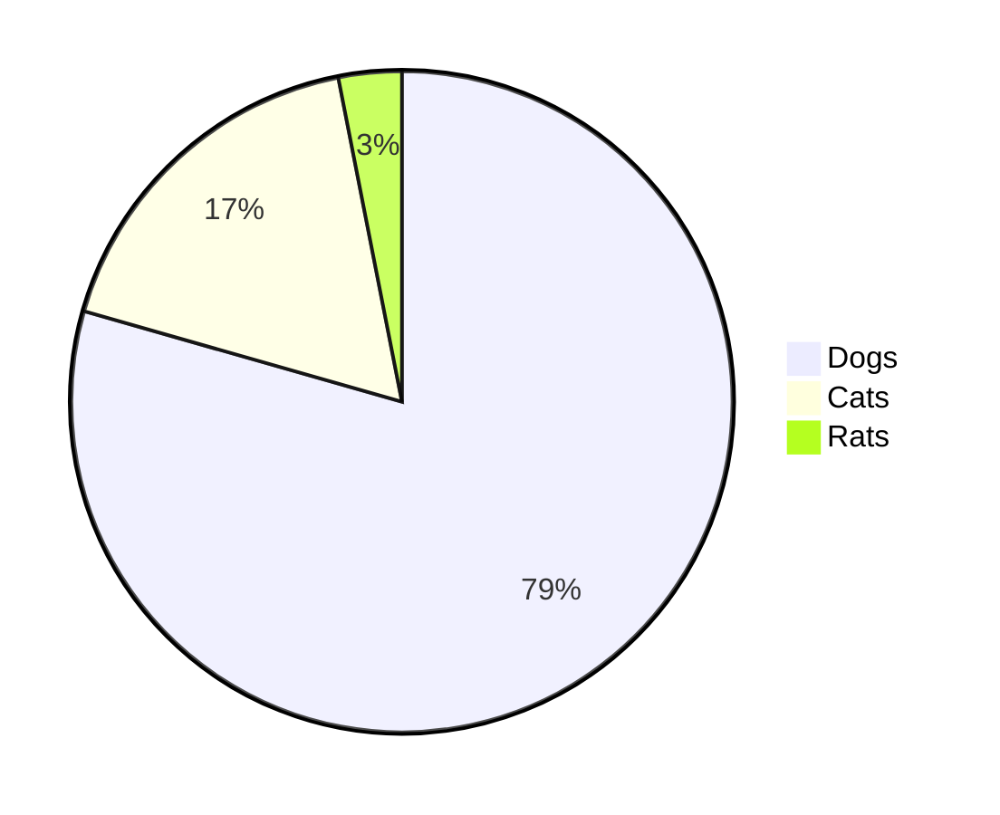
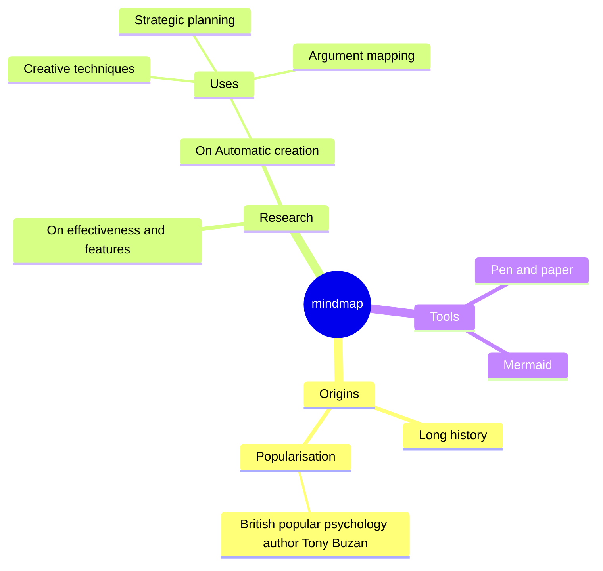
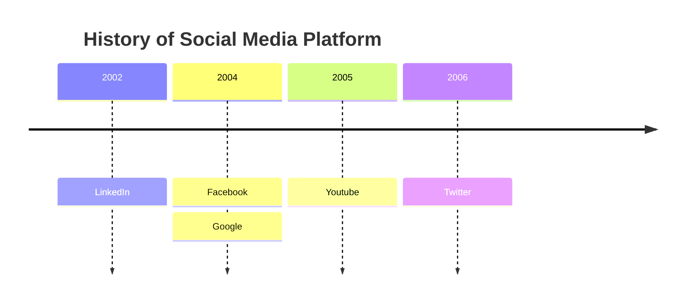

Flussdiagramm

```mermaid
graph TD;
  A-->B;
  A-->C;
  B-->D;
  C-->D;
```

Sequenz-Diagramm

```mermaid
sequenceDiagram
  Alice->>+John: Hello John, how are you?
  Alice->>+John: John, can you hear me?
  John-->>-Alice: Hi Alice, I can hear you!
  John-->>-Alice: I feel great!
```

Gantt-diagramm

```mermaid
gantt
  section A
  A task           :a1, 2024-02-01, 30d
  Another task     :after a1  , 20d
  section B
  Task in sec      :2024-03-12  , 12d
  another task    : 24d
```

Klassendiagramm

```mermaid
---
title: Animal example
---
classDiagram
    note "From Duck till Zebra"
    Animal <|-- Duck
    note for Duck "can fly\ncan swim\ncan dive\ncan help in debugging"
    Animal <|-- Fish
    Animal <|-- Zebra
    Animal : +int age
    Animal : +String gender
    Animal: +isMammal()
    Animal: +mate()
    class Duck{
        +String beakColor
        +swim()
        +quack()
    }
    class Fish{
        -int sizeInFeet
        -canEat()
    }
    class Zebra{
        +bool is_wild
        +run()
    }
```

ER-Diagramm

```mermaid
erDiagram
  CUSTOMER ||--o{ ORDER : places
  ORDER ||--|{ LINE-ITEM : contains
```

State-Diagramm

```mermaid
stateDiagram
  [*] --> State1
  State1 --> [*]
  State1 : this is a string
  State1 : this is another string
```

Pie-Chart

```mermaid
pie
  "Dogs" : 386
  "Cats" : 85
  "Rats" : 15
```

Mindmap

```mermaid
mindmap
  root((mindmap))
    Origins
      Long history
      ::icon(fa fa-book)
      Popularisation
        British popular psychology author Tony Buzan
    Research
      On effectiveness and features
      On Automatic creation
        Uses
            Creative techniques
            Strategic planning
            Argument mapping
    Tools
      Pen and paper
      Mermaid
```

Timeline

```mermaid
timeline
    title History of Social Media Platform
    2002 : LinkedIn
    2004 : Facebook
         : Google
    2005 : Youtube
    2006 : Twitter
```